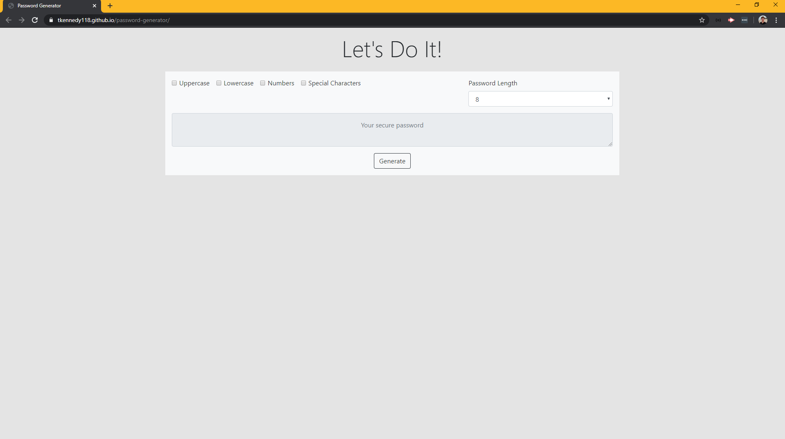

# password-generator

## Link to Deployed Application:
[password-generator](https://tkennedy118.github.io/password-generator/)

## Description:
This is a browser application that generates a random password based on user-selected criteria. Technologies used
include HTML5, CSS, Javascript, and Bootstrap 4.0. 

## Files:
* index.html
* style.css
* script.js

## Screenshot of Application in Browser:
